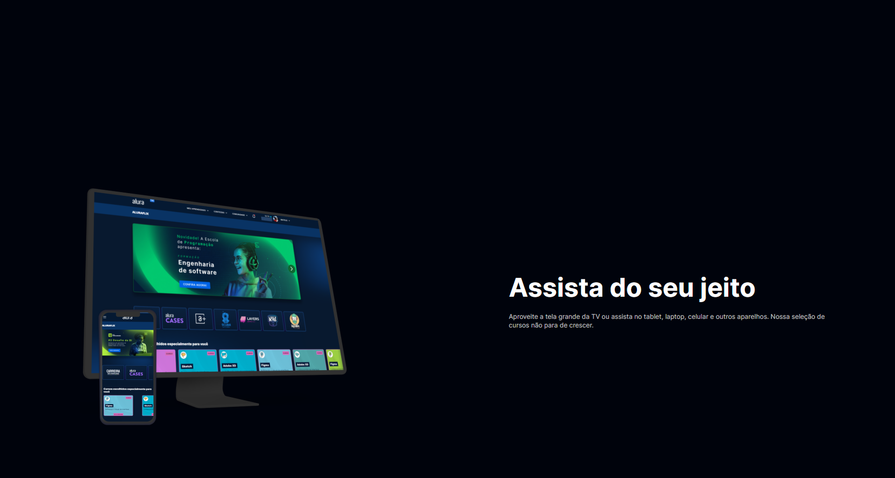
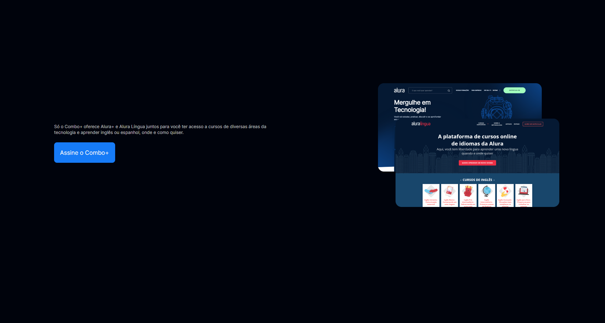
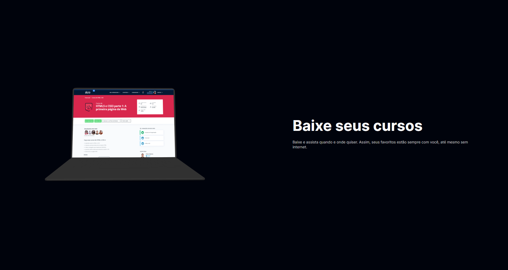

# Projeto Alura Cursos
Alura cursos é um projeto para treinar habilidades adquiridas no curso de Html e css.

## Objetivo
Treinar a utilização do Flex-box para elaboração de layouts.

### Releases

|versão|descrição|link|
-------|---------|----|
v0.0.0|Apresentação do curso e plataforma| https://aluracursos.vercel.app/

## Apresentação do Site

### Assinatura da plataforma

### Dispositivos

### Apresentação do combo

### Plataforma

## Próximas entregas

* Dispositivos compatíveis

* Rodapé do curso